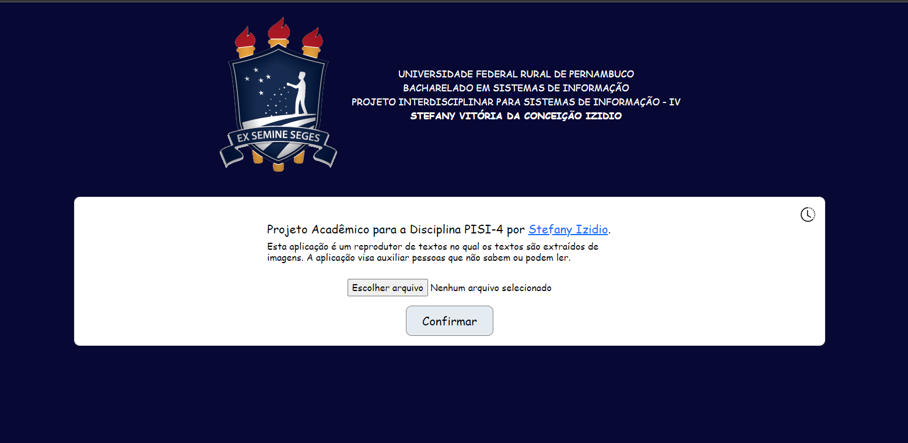

# Projeto Interdisciplinar para Sistemas de Informação - 4

Solução por: Stefany Vitória da Conceição Izidio.

## Descrição do projeto:
A aplicação é um reprodutor de textos no qual os textos são extraídos de imagens e visa auxiliar pessoas que não sabem ou podem ler.

## Serviços da AWS utilizados

* Textract  - Ultilizado para fazer a extração do texto.
* S3 - Ultilizado para armazenamento geral.
* Polly - Ultilizado para fazer a conversão do texto em audio.

## Tecnologias utilizadas
 * Python e suas bibliotecas Flask e boto3.
 * HTML, CSS, Bootstrap.

